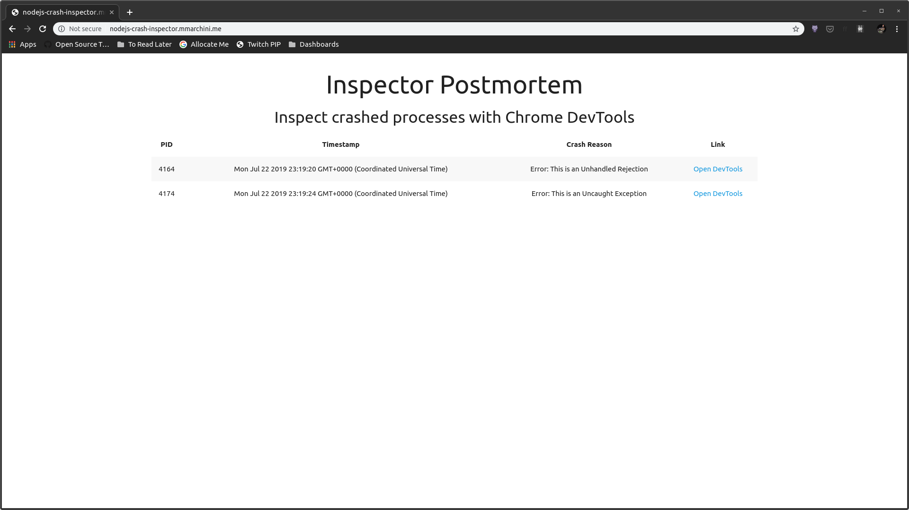
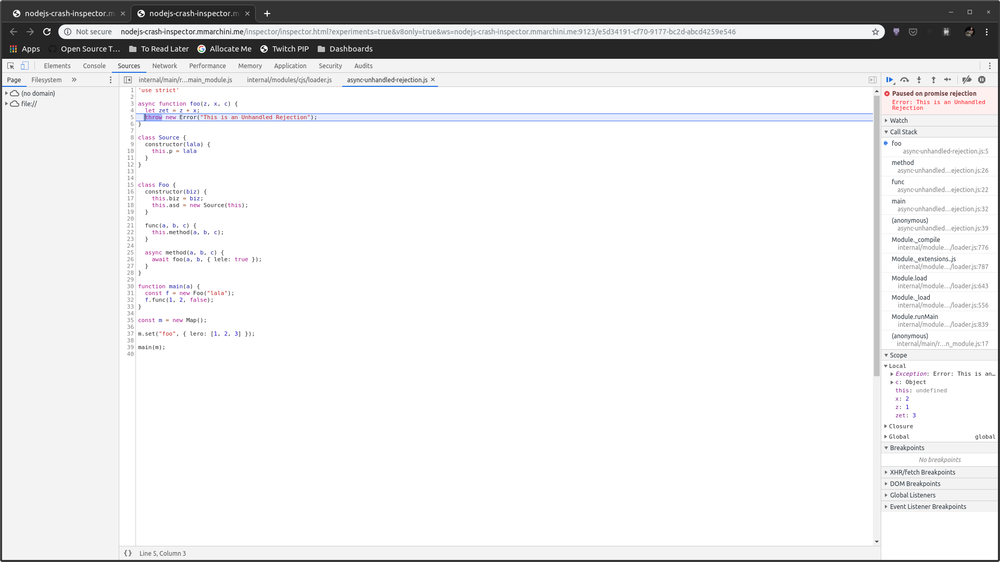

# Inspector Postmortem

This is s POC on how to use the Inspector Protocol to capture the state of a
Node.js process before it crashes due to an uncaught excpetion or unhandled
rejection. The goal is to provide a more accessible, stable and user friendly
postmortem tool which can be used to deal with most crash scenarios.

The basic workflow is:

1. The application hit's an uncaught exception/unhandled rejection
2. Before exiting, we use the Inspector Protocol to save relevant information
   about the process (exception stack trace, scopes, scripts, etc.) as a JSON
   file.
3. Users can later open those JSON files and expose their content through a
   Inspector Protocol-compliant server, allowing tools like Chrome DevTools to
   inspect the state of the process at the crash site after the process already
   exited.

> This tool is not intended to replace core dumps entirely. It will focus on
> JavaScript crashes, while core dumps will still be useful to investigate
> crashes in native code (either on the runtime or third-party libraries).

## Demo

A demo inspector server is available
[here](http://nodejs-crash-inspector.mmarchini.me/). It has a few crash files
you can inspect. The main page is a list of available crash files:



If you click on one of those crash files, a new tab will open with Chrome
DevTools loaded to inspect that file:



This allow you to easily inspect the process state after it crashes. This is
useful for webservers, where you can't just pause the process and inspect it
manually. 

The current crash-collector will save the crash file to the filesystem, and the
server will look for crash files in the filesystem, but this approach can be
extended to upload crash files to cloud storage and the server can be extended
to load from cloud storage, making it possible to have a single server capable
of inspecting crashes from an entire fleet of servers.

### Try it

To generate crash files you just need to require `./crash-collector`. There are
some example scripts in `examples/`, which will crash after execution. If you
want to generate a crash file, you can run:

```
node --require=./crash-collector ./examples/uncaught-exception
```

`./crash-collector` doesn't have any dependencies, as it only uses Node.js builtin
`inspector` module and the `process.on('uncaughtException'` event.

To run the inspector server (demonstrated in the video above) you'll need to 
install `express`, `ws` and `puppeteer`. You can install both and run the
server with the commands below:

```
npm install
node ./server/index.js
```

And then you can access the server in `localhost:3000`

> The inspector server expects the crash files to be in the folder the process
> is running.


## Implementation Overview

> More details can be found at IMPLEMENTATION.md

The module will use the `inspector` module to interact with the inspector
protocol. We use the `Debugger` domain to pause on exceptions. The pause uses
catch prediction, which means the exception might be handled later, which means
we can't just capture the entire state of the VM at the point the exception was
thrown (that would be too expensive if the exception is handled afterwards).
Instead, we only capture the stack frames with references to their local and
closure objects. If the exception was a promiseRejection, we set callbacks to
remove the rejection on a later tick (for unhandled rejections to work, Node.js
must be ran with `--unhandled-rejections='strict'`). If it's a synchronous
exception, we save the stack frame and set a nextTick callback to delete the
stack frames (if a synchronous exception was uncaught, the process will crash
before we get into nextTick).

When the process crashes, we handle it in `process.on("uncaughtException",...)`,
where we'll get the stack frames for the synchronous exception + any possibly
unhandled rejection, and for each frame we'll use the inspector protocol to
collect the value of the local and global variables accessible for each frame.
We also save the source for all scripts in the frames on our call stack.

This information is then saved as a JSON file, which can be used to create a
WebSocket server respecting the inspector protocol, which will return the saved
values for the call stack, variables and script as if the process was paused.
There's an example server which reads these JSON crash files in this repository
as well.


## Limitations and Concerns

1. Can't iterate the heap with getProperties because RemoteObjectId is always
   new (even for the same object).
2. This approach can introduce a huge overhead since we're using the `Debugger`
   domain, which can prevent V8 optimizations in some cases (for example,
   Promises).
3. We might run out of memory while trying to capture the state of the VM
   before exiting.
4. Exit will be delayed until we finish capturing the state of the process.
   Some applications won't have a problem with that, but other applications
   won't be able to cope with the exit delay.
5. The approach used to get unhandled rejections is not optimal
   (https://github.com/mmarchini/inspector-postmortem/blob/master/crash-collector/partial.js#L77-L89)
   and doesn't seem reliable (I got unhandled rejections which didn't trigger
   `Debugger.paused`).
