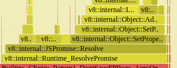
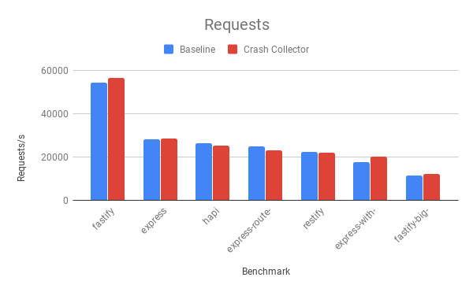
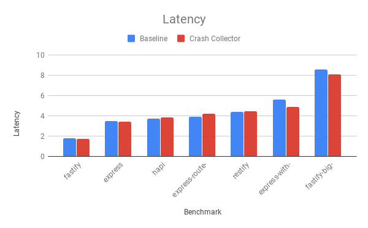
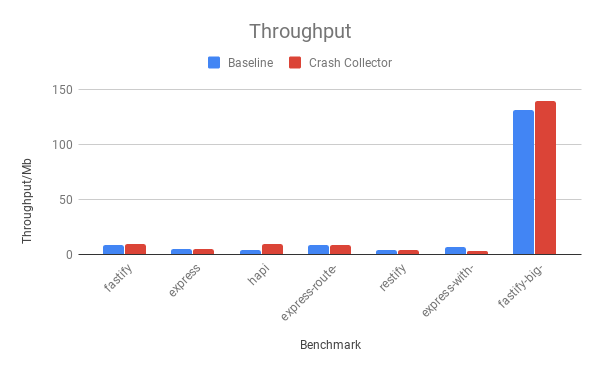

# Benchmarks

> NOTE: `crash-collector` refers to the prototype module available in this
> repository which will gather the process state before it crashes.

These benchmarks are intended to measure the runtime overhead introduced by
`crash-collector`. Ideally, we should also have benchmarks to measure the exit
delay when the module is used, but first we should work on making runtime
overhead as low as possible, otherwise the module will not be useful for
production systems.

## [v8/promise-performance-tests](https://github.com/v8/promise-performance-tests)

One on my biggest concerns while working on this module was the performance
impact on Promises due to how V8's catch prediction works (all Promise 
rejections will trigger `Debugger.paused`). To evaluate this hyposteis, a
Promise-heavy benchmak can be used, and
[v8/promise-performance-tests](https://github.com/v8/promise-performance-tests)
is perfect for that.

> NOTE: I actually used a slightly modified version of
> [v8/promise-performance-tests](https://github.com/v8/promise-performance-tests) available at 
> [mmarchini/promise-performance-tests@crash-collector-tests](https://github.com/mmarchini/promise-performance-tests/tree/crash-collector/tests)

| Test                            | Baseline  | With `crash-collector` |
|---------------------------------|-----------|------------------------|
| doxbee-async-es2017-native      | 62.17 ms  | 195.01 ms              |
| doxbee-promises-es2015-native   | 84.04 ms  | 182.33 ms              |
| fibonacci-async-es2017-native   | 530.3 ms  | 1500.35 ms             |
| parallel-async-es2017-native    | 197.1 ms  | 480.79 ms              |
| parallel-promises-es2015-native | 158.45 ms | 389.04 ms              |

As we can see, the overhead is around 100%-200%, depending on the test. We can
use [flamegraphs](assets/promise-performance-flamegraphs) to better understand
where this overhead is coming from.  Looking at flamegraphs for both the
baseline tests and the tests with `crash-collector` loaded, we'll find
`Runtime_PromiseResolve` being called on the test with `crash-collector`, but
not on the baseline tests.

Looking at V8 source code, `Runtime_PromiseResolve` is a slow path and is only
used when PromiseHooks are used or the Debugger domain is enabled. Further
testing confirms that the overhead is coming mostly from having the Debugger
domain enabled, and not from processing `Debugger.paused` (although this might
be due to this benchmark not having a high ratio of Promise rejections).

## Fastify Benchmarks

[fastify/benchmarks](https://github.com/fastify/benchmarks) has benchmarks for
several popular Node.js HTTP servers, making it a good benchmark suite to
evaluate the overhead of `crash-collector`

To run fastify benchmark suite with `crash-collector`, we call it with
`NODE_OPTIONS="--require=../../crash-collector" node benchmark.js bench` from
the submodule `fastify-benchmarks` in this folder. We also call it without
`crash-collector` to use as baseline.

Overhead on this benchmark suite was not noticeable (as you can see in the
tables and charts below), with only a small variance in
requests/latency/throughput, and sometimes the results with `crash-collector`
were better than without it, which indicates noise on the benchmark results
(since it shouldn't be faster to run these benchmarks with `crash-collector`).

### Requests

| Benchmark                | Baseline | Crash Collector |
|--------------------------|----------|-----------------|
| fastify                  | 54620    | 56606.4         |
| express                  | 28200.4  | 28544.8         |
| hapi                     | 26280    | 25365.6         |
| express-route-prefix     | 24933.2  | 23117.2         |
| restify                  | 22187.3  | 21828.8         |
| express-with-middlewares | 17489.1  | 20169.2         |
| fastify-big-json         | 11450.15 | 12146.2         |

### Latency

| Benchmark                | Baseline | Crash Collector |
|--------------------------|----------|-----------------|
| fastify                  | 1.75     | 1.69            |
| express                  | 3.45     | 3.41            |
| hapi                     | 3.72     | 3.85            |
| express-route-prefix     | 3.92     | 4.22            |
| restify                  | 4.4      | 4.47            |
| express-with-middlewares | 5.61     | 4.87            |
| fastify-big-json         | 8.61     | 8.11            |

### Throughput

| Benchmark                | Baseline | Crash Collector |
|--------------------------|----------|-----------------|
| fastify                  | 8.54     | 8.85            |
| express                  | 4.41     | 4.46            |
| hapi                     | 4.11     | 8.83            |
| express-route-prefix     | 8.68     | 8.36            |
| restify                  | 3.51     | 3.46            |
| express-with-middlewares | 6.32     | 3.15            |
| fastify-big-json         | 131.47   | 139.46          |

